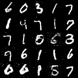

# MNIST Deep Learning Experiments

Two PyTorch implementations exploring generative and discriminative deep learning on the MNIST handwritten digit dataset: a vanilla **GAN** that learns to generate digit images, and a **CNN classifier** that recognizes them.

| Model | Task | Result |
|---|---|---|
| GAN (fully-connected generator/discriminator) | Generate realistic MNIST digits from random noise | Stable adversarial training over 50 epochs |
| CNN (2 conv layers + 3 FC layers) | Classify digits 0-9 | ~99.25% test accuracy after 10 epochs |

## Demo



*Digits generated by the trained GAN generator (run training to produce this image).*

## Project structure

```
deep_learning_experiments/
├── README.md
├── requirements.txt
├── src/
│   ├── models.py        # Generator, Discriminator, MNISTCNN
│   ├── data.py           # DataLoader helpers
│   ├── utils.py          # logging, seeding, checkpointing
│   ├── train_gan.py       # GAN training entry point
│   └── train_cnn.py       # CNN training entry point
├── configs/
│   ├── gan_default.yaml
│   └── cnn_default.yaml
├── tests/
    └── test_models.py    # shape/sanity unit tests

```

## Setup

```bash
git clone https://github.com/chlamcf/deep_learning_experiments.git
cd deep_learning_experiments
python -m venv venv && source venv/bin/activate   # optional
pip install -r requirements.txt
```

MNIST is downloaded automatically into `./data` on first run via `torchvision.datasets.MNIST`.

## Usage

### Train the CNN classifier

```bash
python -m src.train_cnn --epochs 10 --batch-size 64 --lr 0.001
```

### Train the GAN

```bash
python -m src.train_gan --epochs 50 --batch-size 128 --lr 0.0002 --latent-dim 100
```

Generated sample grids are saved to `outputs/gan_images/epoch_<N>.png` after every epoch, and model checkpoints to `outputs/gan_models/` and `outputs/cnn_models/` respectively.

All hyperparameters are exposed as CLI flags (see `--help` on either script) and mirrored in `configs/*.yaml` for reference.

### Run tests

```bash
pytest tests/
```

## Model details

**Generator / Discriminator (GAN)**
- Generator: `Linear(100→256→512→1024→784)` with ReLU activations and a final `Tanh`, reshaped to 28x28.
- Discriminator: `Linear(784→1024→512→256→1)` with LeakyReLU(0.2) activations and a final `Sigmoid`.
- Loss: Binary Cross-Entropy (BCE), optimized with Adam (`lr=0.0002`, `betas=(0.5, 0.999)`) for both networks, following standard DCGAN-paper conventions adapted to fully-connected layers.

**CNN classifier**
- Two `Conv2d` layers (1→32→64 channels, 3x3 kernels) each followed by ReLU and 2x2 max pooling.
- Three fully-connected layers (`3136→128→64→10`).
- Loss: Cross-Entropy, optimized with Adam (`lr=0.001`).

## Results

| Metric | Value |
|---|---|
| CNN test accuracy (epoch 10) | 99.25% |
| CNN test loss (epoch 10) | 0.0282 |
| GAN training epochs | 50 |

Loss curves and generated sample grids can be found in `outputs/` after running the training scripts.
## Possible extensions

- Swap the GAN's fully-connected layers for convolutional/transposed-convolutional layers (DCGAN) for sharper, more stable image generation.
- Add a Wasserstein loss with gradient penalty (WGAN-GP) to reduce mode collapse.
- Evaluate the GAN quantitatively with Frechet Inception Distance (FID) instead of visual inspection only.
- Add batch normalization, dropout, and data augmentation to the CNN, and benchmark against a small ResNet.
- Extend both models to a harder dataset (Fashion-MNIST or CIFAR-10).

## Notes

The content was originally written for coursework, it was then further developed into a reusable, testable project structure.
